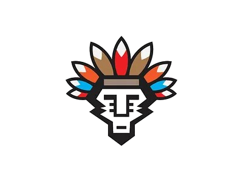

# Tribal History Lab



A modern web application dedicated to preserving tribal traditions and empowering communities. This project features a responsive landing page and user authentication interfaces.

---
````markdown
# Tribal History Lab


A modern web application dedicated to preserving tribal traditions and empowering communities. This project features a responsive landing page and user authentication interfaces.

---

## 📌 About the Project

**Tribal History Lab** is a personal learning project created to understand and present information about tribal history, culture, and heritage in a simple and structured way.  
The main goal of this project is **knowledge enhancement** along with **practical skill development** in modern web technologies.

This project is built as part of my continuous learning journey and may be updated regularly with new features and content.

---

## 🎯 Objectives

- Learn and explore tribal history and heritage
- Improve front-end web development skills
- Practice clean UI design and layout structure
- Build a portfolio-ready project for future growth

## 🛠️ Technologies Used

- **Frontend**: React.js
- **Styling**: Tailwind CSS
- **Routing**: React Router DOM
- **Icons**: Heroicons
- **UI Components**: Headless UI

## ✨ Features

- **Modern Landing Page**: A beautiful hero section with smooth scrolling navigation.
- **User Authentication**: Clean and responsive Login and Registration pages.
- **Responsive Design**: Built with Tailwind CSS to look good on mobile and desktop.
- **Single Page Navigation**: Seamless transition between sections.

## 📸 Screenshots


## 🚀 Getting Started

Follow these steps to run the project locally:

1. **Clone the repository**
   ```bash
   git clone <repository-url>
   ```

2. **Install dependencies**
   ```bash
   npm install
   ```

3. **Run the development server**
   ```bash
   npm run dev
   ```

4. Open your browser and navigate to `http://localhost:5173`.

## 🚀 Future Improvements

- Add more detailed historical content
- Improve UI/UX design
- Add images, timelines, and interactive sections
- Connect with a backend or database (optional)

## 📚 Learning Outcome

Through this project, I am improving:
- Web development fundamentals
- UI design skills
- Project structuring and GitHub usage
- Research and content presentation skills

## 🧑‍💻 Author

**Tanmay**  
A passionate learner focused on improving software development skills.

## 📄 License

This project is created for learning and educational purposes.

````

---

## 📄 License

This project is created for learning and educational purposes.

---

## 🚀 Deploying to Vercel

This project is preconfigured for Vercel using the `@vercel/static-build` adapter. The Vite build output goes to `dist` and the SPA is routed to `index.html` via `vercel.json`.

Quick steps to deploy:

1. Build locally to verify:

```bash
npm install
npm run build
```

2. Deploy via the Vercel dashboard by connecting this repository, or use the Vercel CLI:

```bash
npm i -g vercel
vercel login
vercel --prod
```

Vercel will run `npm run build` and serve the `dist` folder. If you want a preview deployment, run `vercel` without `--prod`.
